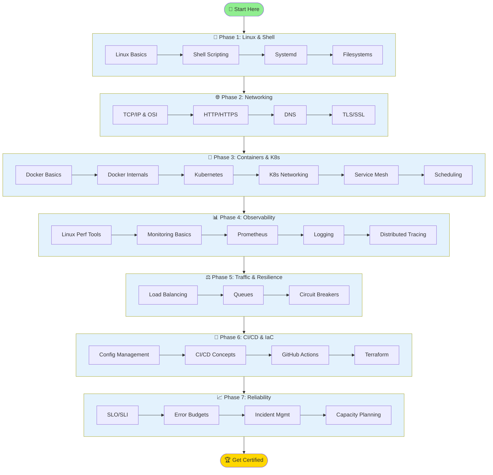

# 🚀 DevOps Fundamentals

> A structured, beginner-friendly roadmap for aspiring DevOps Engineers — covering everything from Linux basics to incident management.


[](https://github.com/hacrex/devops-fundamentals/stargazers)

---

## ⭐ Why Star This Repo?

**Join 1,000+ learners** mastering DevOps with our comprehensive curriculum!

✨ **What you get:**
- 📚 **30+ detailed topics** from Linux to Reliability Engineering
- 🧪 **7 hands-on labs** with real-world scenarios
- 📝 **Complete assessment framework** with quizzes & certificate
- 🛠️ **Cheat sheets** and interview prep materials
- 🆓 **100% free** - No signup required

**🎯 Goal: Help 10,000 developers transition into DevOps roles!**

> 💡 **Star this repo** to support the project and help other beginners find it!  
> Every ⭐ brings us closer to our goal and unlocks new community features!

---

## 🗺️ Visual Learning Roadmap



### 🎯 Learning Path Overview

| Phase | Focus | Topics | Labs | Time Estimate | Difficulty |
|-------|-------|--------|------|---------------|------------|
| **1** | 🐧 Linux & Shell | 4 | ✅ Lab 1 | 2-3 weeks | 🟢 Beginner |
| **2** | 🌐 Networking | 4 | ✅ Lab 2 | 2-3 weeks | 🟢 Beginner |
| **3** | 🐳 Containers & K8s | 6 | ✅ Lab 3,5 | 3-4 weeks | 🟡 Intermediate |
| **4** | 📊 Observability | 5 | ✅ Lab 2,4 | 3-4 weeks | 🟡 Intermediate |
| **5** | ⚖️ Resilience | 3 | ✅ Lab 7 | 2 weeks | 🟡 Intermediate |
| **6** | 🔧 CI/CD & IaC | 4 | ✅ Lab 1,3,6 | 3-4 weeks | 🔴 Advanced |
| **7** | 📈 Reliability | 4 | ✅ Capstone | 2-3 weeks | 🔴 Advanced |

**Total Journey:** ~18-23 weeks (4-6 months) to complete all phases + certifications

---

## 📖 About This Repository

This repository is a **curated learning path** for beginners who want to become DevOps Engineers. It covers 30 essential topics organized into logical learning phases — from foundational Linux skills to advanced reliability engineering.

Whether you're a developer looking to move into DevOps, a student exploring career paths, or a sysadmin modernizing your skills — this guide is for you.

---

## 🗺️ Learning Roadmap

```
Phase 1: Linux & Shell  →  Phase 2: Networking  →  Phase 3: Containers & K8s
        ↓                           ↓                          ↓
Phase 4: Observability  →  Phase 5: CI/CD & IaC  →  Phase 6: Reliability
```

---

## 📚 Topics

### 🐧 Phase 1 — Linux & System Fundamentals
| # | Topic | Description |
|---|-------|-------------|
| 1 | **Linux Basics** | File system, commands, permissions, users |
| 2 | **Shell Scripting** | Bash scripting, automation, cron jobs |
| 3 | **Systemd Deep Dive** | Services, units, journald, boot process |
| 4 | **Filesystems & I/O** | Disk management, inodes, I/O scheduling |

---

### 🌐 Phase 2 — Networking
| # | Topic | Description |
|---|-------|-------------|
| 5 | **Networking Basics** | TCP/IP, OSI model, subnets, routing |
| 6 | **HTTP Internals** | Request/response lifecycle, headers, HTTP/2 |
| 7 | **TLS & Certs** | SSL/TLS handshake, certificates, PKI |
| 8 | **DNS in Practice** | Name resolution, records, debugging DNS |

---

### 🐳 Phase 3 — Containers & Kubernetes
| # | Topic | Description |
|---|-------|-------------|
| 9 | **Containers 101** | What are containers, namespaces, cgroups |
| 10 | **Docker Internals** | Images, layers, volumes, networking |
| 11 | **Kubernetes Basics** | Pods, deployments, services, kubectl |
| 12 | **K8s Networking** | CNI plugins, ClusterIP, NodePort, DNS |
| 13 | **Ingress & Service Mesh** | Ingress controllers, Istio, traffic management |
| 14 | **Pod Scheduling** | Taints, tolerations, affinity, resource limits |

---

### 📊 Phase 4 — Observability
| # | Topic | Description |
|---|-------|-------------|
| 15 | **Linux Perf Tools** | top, htop, perf, strace, lsof |
| 16 | **Observability 101** | Metrics, logs, traces — the three pillars |
| 17 | **Prometheus Basics** | Metrics collection, exporters, PromQL |
| 18 | **Logging Practices** | Structured logging, log aggregation, 12-factor |
| 19 | **Tracing Intro** | Distributed tracing, OpenTelemetry, Jaeger |

---

### ⚖️ Phase 5 — Traffic & Resilience
| # | Topic | Description |
|---|-------|-------------|
| 20 | **Load Balancers** | L4 vs L7, HAProxy, NGINX, algorithms |
| 21 | **Queues & Backpressure** | Message queues, Kafka basics, flow control |
| 22 | **Circuit Breakers & Retries** | Fault tolerance patterns, exponential backoff |

---

### 🔧 Phase 6 — CI/CD & Infrastructure as Code
| # | Topic | Description |
|---|-------|-------------|
| 23 | **Config Management** | Ansible, Chef, Puppet — declarative config |
| 24 | **CI/CD Basics** | Pipelines, build, test, deploy concepts |
| 25 | **GitHub Actions** | Workflows, actions, secrets, CI automation |
| 26 | **Infra as Code** | Terraform, state management, modules |

---

### 📈 Phase 7 — Reliability Engineering
| # | Topic | Description |
|---|-------|-------------|
| 27 | **SLOs & SLIs** | Service Level Objectives, error budgets |
| 28 | **Incident Management** | On-call, escalation, runbooks |
| 29 | **Postmortems** | Blameless culture, RCA, action items |
| 30 | **Capacity Planning** | Forecasting, load testing, scaling strategies |

---

## 🧪 Hands-on Labs

| Lab | Title | Tools Used | Difficulty | Time |
|-----|-------|-----------|------------|------|
| [Lab 1](./hands-on-labs/lab-01-nodejs-docker-cicd.md) | Deploy Node.js App with Docker + GitHub Actions | Docker, GitHub Actions | 🟢 Beginner | 45 min |
| [Lab 2](./hands-on-labs/lab-02-prometheus-grafana.md) | Prometheus + Grafana Monitoring Stack | Prometheus, Grafana, Docker Compose | 🟢 Beginner | 60 min |
| [Lab 3](./hands-on-labs/lab-03-terraform-aws-ec2.md) | Infrastructure as Code with Terraform | Terraform, AWS EC2 | 🟡 Intermediate | 45 min |
| [Lab 4](./hands-on-labs/lab-04-elk-stack-logging.md) | ELK Stack for Centralized Logging | Elasticsearch, Logstash, Kibana, Filebeat | 🟡 Intermediate | 90 min |
| [Lab 5](./hands-on-labs/lab-05-kubernetes-helm.md) | Kubernetes Deployment with Helm | Kubernetes, Helm, Docker | 🟡 Intermediate | 75 min |
| [Lab 6](./hands-on-labs/lab-06-github-actions-argocd.md) | CI/CD Pipeline with GitHub Actions + ArgoCD | GitHub Actions, ArgoCD, Helm | 🔴 Advanced | 90 min |
| [Lab 7](./hands-on-labs/lab-07-chaos-engineering.md) | Chaos Engineering with Chaos Mesh | Chaos Mesh, Kubernetes | 🔴 Advanced | 60 min |

---

## 🛠️ Quick Start

```bash
# Run pre-flight check to verify your environment
./scripts/preflight.sh

# If all checks pass, start with Lab 1
cat hands-on-labs/lab-01-nodejs-docker-cicd.md
```

### Need Help?

- 📖 **Troubleshooting Guide**: See [TROUBLESHOOTING.md](./TROUBLESHOOTING.md) for common issues and solutions
- 🏃 **Pre-flight Check**: Run `./scripts/preflight.sh` to verify your setup
- 💬 **Community**: Join our discussions for help and support

---

## 📋 Cheatsheets

| Cheatsheet | Description |
|-----------|-------------|
| [Linux Commands](./cheatsheets/linux-commands.md) | File, process, network, SSH commands |
| [Docker & kubectl](./cheatsheets/docker-kubectl.md) | Docker and Kubernetes quick reference |
| [Git Commands](./cheatsheets/git-commands.md) | Complete Git workflow reference |
| [Vim & Nano](./cheatsheets/vim-nano.md) | Editor shortcuts and modes |

---

## ⚔️ Tools Comparison

Side-by-side comparisons to help you choose the right tool:
- Jenkins vs GitHub Actions vs GitLab CI
- Ansible vs Terraform vs Puppet
- Prometheus vs Datadog vs New Relic
- AWS vs GCP vs Azure

👉 [View Tools Comparison](./tools-comparison/README.md)

---

## 💼 Interview Prep

33 Q&A covering all major DevOps topics including scenario-based questions.

👉 [View Interview Questions](./interview-prep/top-50-questions.md)

---

## 📚 Free Resources

Curated free courses, docs, YouTube channels, and practice platforms for every topic.

👉 [View Free Resources](./resources/FREE-RESOURCES.md)

---

## ✅ Progress Tracker

Fork this repo and track your own learning journey with our checklist.

👉 [View Progress Tracker](./progress-tracker/PROGRESS.md)

---

## 🗂️ Repo Structure

```
devops-fundamentals/
├── README.md
├── CONTRIBUTING.md
├── CHANGELOG.md
├── cheatsheets/
│   ├── linux-commands.md
│   ├── docker-kubectl.md
│   ├── git-commands.md
│   └── vim-nano.md
├── interview-prep/
│   └── top-50-questions.md
├── hands-on-labs/
│   ├── lab-01-nodejs-docker-cicd.md
│   ├── lab-02-prometheus-grafana.md
│   └── lab-03-terraform-aws-ec2.md
├── tools-comparison/
│   └── README.md
├── resources/
│   └── FREE-RESOURCES.md
├── progress-tracker/
│   └── PROGRESS.md
├── phase-1-linux/
├── phase-2-networking/
├── phase-3-containers/
├── phase-4-observability/
├── phase-5-resilience/
├── phase-6-cicd/
└── phase-7-reliability/
```

---

## 🚦 How to Use This Repo

1. **Start from Phase 1** and work your way through each phase in order
2. Use the **cheatsheets** as quick references while learning
3. Complete the **hands-on labs** to apply what you learn
4. Use **free resources** for deeper study on each topic
5. Track your progress with the **progress tracker**
6. Prepare for jobs with the **interview Q&A**
7. Don't rush — spend at least **2–3 days per topic**

---


## 📝 Assessments & Certification

Test your knowledge and earn a certificate!

### Assessment Structure
- **7 Phase Quizzes** - Multiple-choice questions for each phase
- **7 Practical Challenges** - Hands-on exercises testing real-world skills  
- **Capstone Project** - Comprehensive project combining all skills
- **Certificate** - Earn upon completing all requirements

📁 **[View All Assessments](./assessments/)**

### Progress Tracking
| Phase | Quiz | Challenge | Status |
|-------|------|-----------|--------|
| 1. Linux | [Quiz](./assessments/quizzes/phase-01-linux-quiz.md) | [Challenge](./assessments/challenges/phase-01-linux-challenge.md) | ⬜ |
| 2. Networking | [Quiz](./assessments/quizzes/phase-02-networking-quiz.md) | [Challenge](./assessments/challenges/phase-02-networking-challenge.md) | ⬜ |
| 3. Containers | [Quiz](./assessments/quizzes/phase-03-containers-quiz.md) | [Challenge](./assessments/challenges/phase-03-challenge.md) | ⬜ |
| 4. Observability | [Quiz](./assessments/quizzes/phase-04-quiz.md) | [Challenge](./assessments/challenges/phase-04-challenge.md) | ⬜ |
| 5. Resilience | [Quiz](./assessments/quizzes/phase-05-quiz.md) | [Challenge](./assessments/challenges/phase-05-challenge.md) | ⬜ |
| 6. CI/CD & IaC | [Quiz](./assessments/quizzes/phase-06-quiz.md) | [Challenge](./assessments/challenges/phase-06-challenge.md) | ⬜ |
| 7. Reliability | [Quiz](./assessments/quizzes/phase-07-quiz.md) | [Challenge](./assessments/challenges/phase-07-challenge.md) | ⬜ |

### 🏆 Capstone Project
Design and implement a complete DevOps pipeline with CI/CD, monitoring, and resilience features.

📁 **[View Capstone Details](./assessments/capstone/README.md)**

### 🎓 Certificate
Earn a **DevOps Fundamentals Certificate** upon completing:
- ✅ All 7 quizzes (80%+ score)
- ✅ All 7 practical challenges
- ✅ Capstone project

📁 **[Certificate Template](./assessments/certificate-template.md)**

---

## 💻 Platforms You SHOULD Be Using (DevOps Version of LeetCode)

Level up your skills with these hands-on practice platforms!

| Platform | Best For | Focus Area | Why Use It? |
|----------|----------|------------|-------------|
| [💻 **KodeKloud**](https://kodekloud.com/) | Beginners → Intermediate | Real labs for Docker, K8s, Terraform, Ansible | Famous "100 Days of DevOps" challenge |
| [🧩 **SadServers**](https://sadservers.com/) | SRE & Debugging | Pure SRE-style debugging scenarios | Broken servers → you fix them (interview-level!) |
| [🐳 **Fixtheops.dev**](https://fixtheops.dev/) | Docker Challenges | Container misconfigs & debugging | LeetCode for DevOps - small problems, big clarity |
| [⚙️ **HackerRank**](https://www.hackerrank.com/domains/shell) | Foundation Building | Linux, Shell scripting, Infrastructure logic | Not just DSA - strengthen your core skills |
| [☁️ **Play with Docker/K8s**](https://labs.play-with-docker.com/) | Risk-free Practice | Free browser-based labs | No setup needed - experiment without fear |
| [📚 **Exercism**](https://exercism.org/tracks) | Guided Learning | IaC + Scripting fundamentals | Learn → Feedback → Improve with mentors |

### 🎯 Reality Check

> **👉 DevOps ≠ Tools**  
> **👉 DevOps ≠ Just YAML**

**DevOps IS about:**
- 🔍 **Debugging** – Finding root causes quickly
- ⚡ **Thinking under pressure** – Handling incidents calmly
- 🧠 **Understanding systems** – Knowing how pieces fit together

### 🛣️ Beginner Practice Roadmap

1. **Start with [KodeKloud](https://kodekloud.com/)** → Build basics
2. **Experiment with [Play with Docker/K8s](https://labs.play-with-docker.com/)** → Practice freely
3. **Solve mini-problems on [Fixtheops](https://fixtheops.dev/)** → Get comfortable
4. **Face real-world chaos on [SadServers](https://sadservers.com/)** → Test your skills 🔥

👉 **[Explore Full Practice Arena](./practice/README.md)** for detailed guides, tracking sheets, and pro tips!

---

## 🤝 Contributing

Contributions are welcome! Help us grow this resource for the community.

### 🌟 How to Contribute
- **Fix typos** or improve explanations
- **Add new labs** or practical exercises
- **Translate** content to other languages
- **Share** your success stories
- **Suggest** new topics or improvements

👉 Read our [CONTRIBUTING.md](./CONTRIBUTING.md) for detailed guidelines.

### 🏆 Community Contributors
We recognize all contributors who help make this project better!

[](https://github.com/hacrex/devops-fundamentals/graphs/contributors)

---

## ⭐ Support This Project

**If this helped you, please star the repo!** ⭐

Your support helps:
- 🎯 Other beginners find this free resource
- 📈 Motivate us to create more content
- 🚀 Reach our goal of 10,000 learners
- 💡 Unlock community features and updates

[](https://github.com/hacrex/devops-fundamentals/stargazers)

### 🎁 Star Milestones
- ⭐ **100 stars** - New advanced Kubernetes lab
- ⭐ **500 stars** - Video tutorials for each phase
- ⭐ **1,000 stars** - Interactive quizzes platform
- ⭐ **5,000 stars** - Live cohort-based course

---

## 📢 Join Our Community

- 💬 **GitHub Discussions** - Ask questions, share progress
- 🐦 **Twitter/X** - Follow for daily DevOps tips
- 💼 **LinkedIn** - Connect with fellow learners
- 📧 **Newsletter** - Get monthly updates (coming soon)

---

## 📄 License

MIT License — free to use, share, and modify.

---

<p align="center">Made with ❤️ for the DevOps community by <a href="https://github.com/hacrex">@hacrex</a></p>
